# C Library Management System

A terminal-based library management system written in C. The project provides role-based access for users and admins, manages a book catalog through plain-text storage, tracks borrowing activity, applies due dates, and validates input from a menu-driven command-line interface.

## Features

### User

- Sign up and log in with password validation.
- Store passwords as djb2 hashes instead of plain text.
- View the complete book catalog.
- Search books by title or author with case-insensitive matching.
- Borrow available books.
- Return borrowed books.
- Track personal borrowing history with due dates and return status.
- Display overdue notices during return.

### Admin

- Access every user feature.
- Add books with title, author, and publication year.
- Remove books when they are not currently borrowed.
- View registered users and roles.
- Review borrowing history across all users.

## Default Admin Account

| Field | Value |
| --- | --- |
| Username | `admin` |
| Password | `Admin@123` |

The default admin account is created automatically on the first run when `users.txt` does not exist.

## Tech Stack

| Part | Tech |
| --- | --- |
| Language | C |
| Standard | C99 |
| Interface | Terminal |
| Storage | Plain-text files |
| Build | GCC, MinGW, MSYS2, or Make |

## Screenshots

### Admin Operations

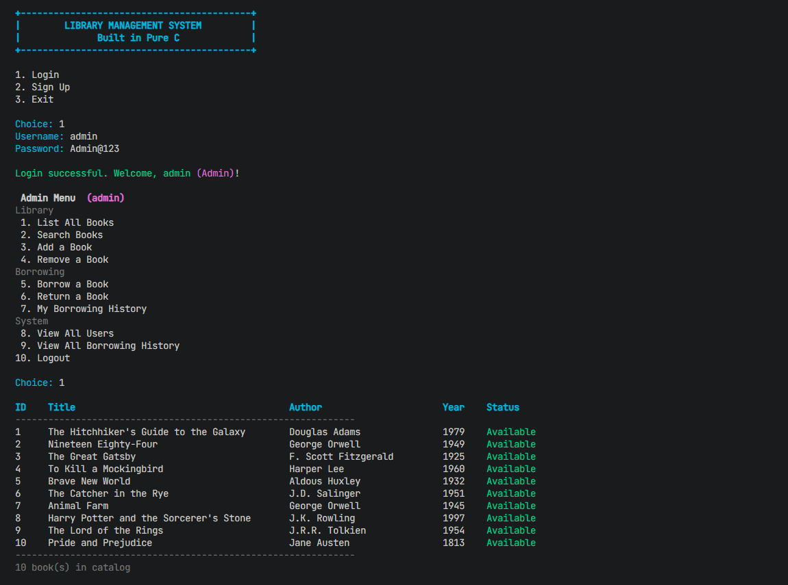

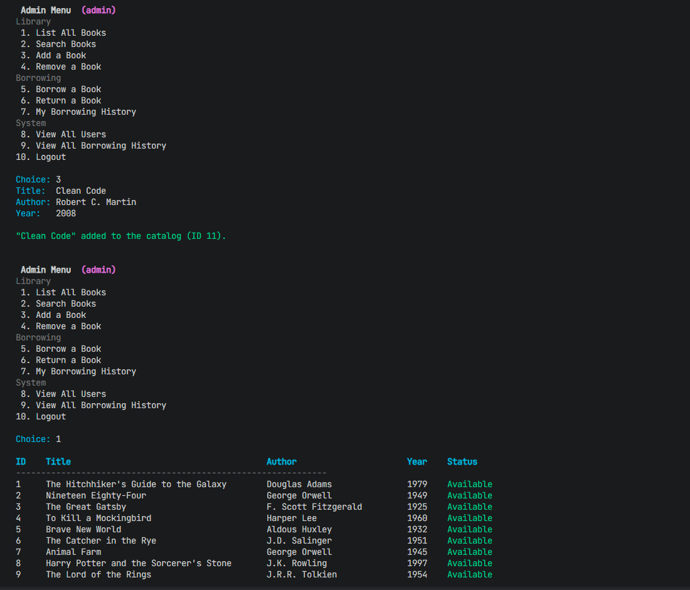

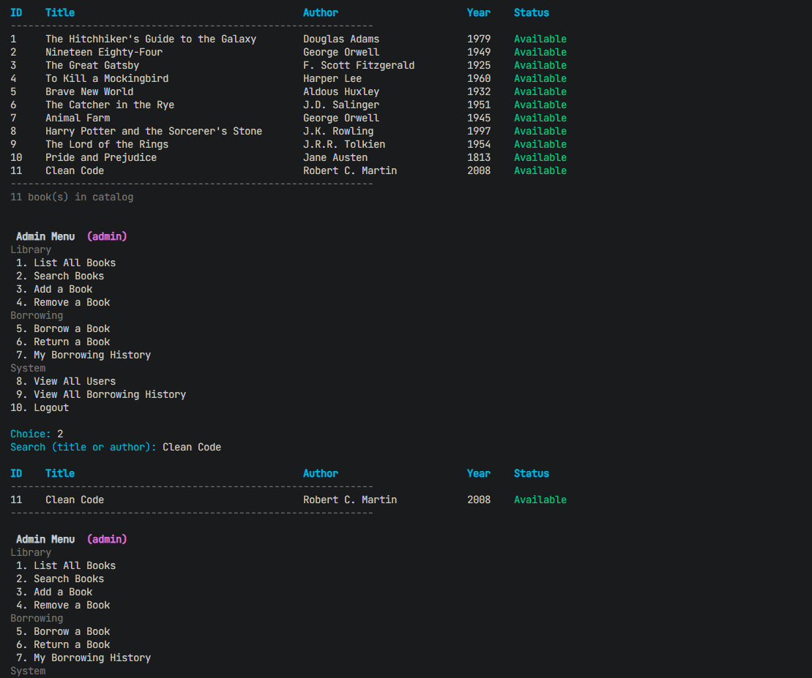

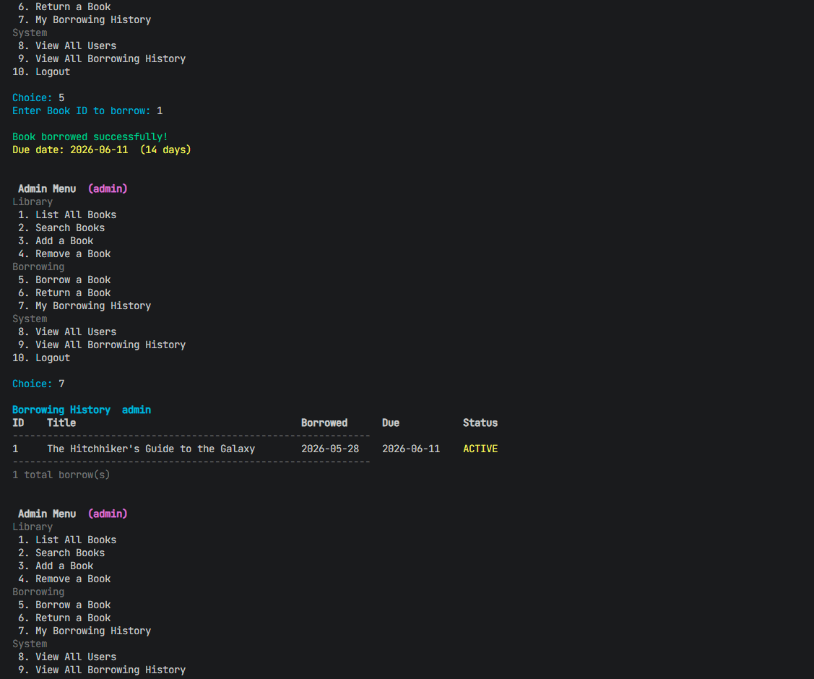

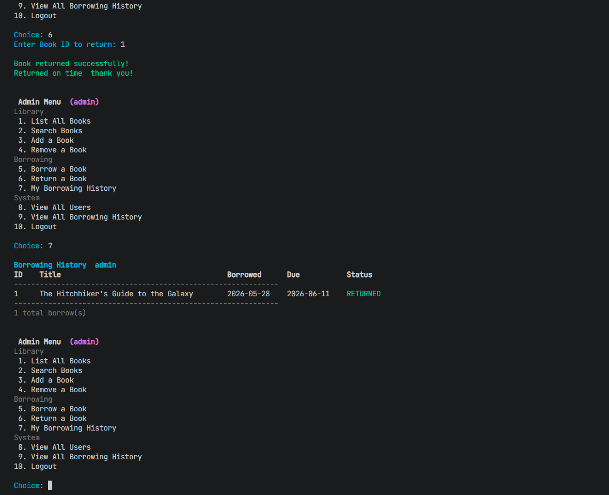

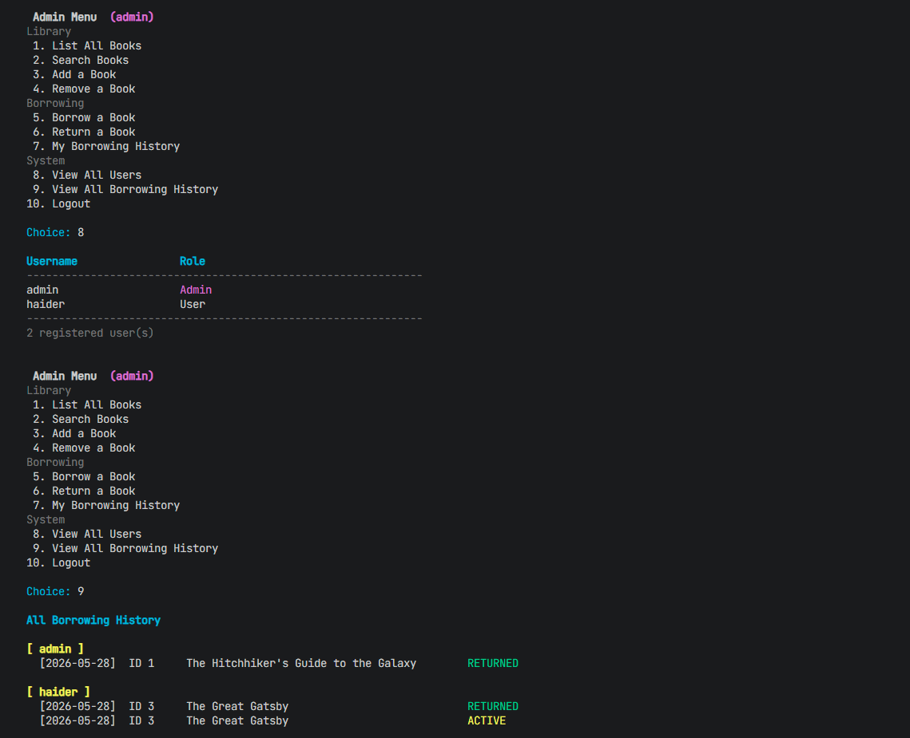

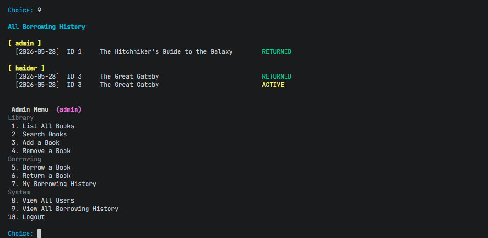

### User Operations

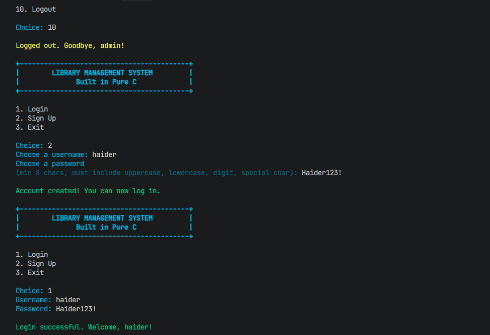

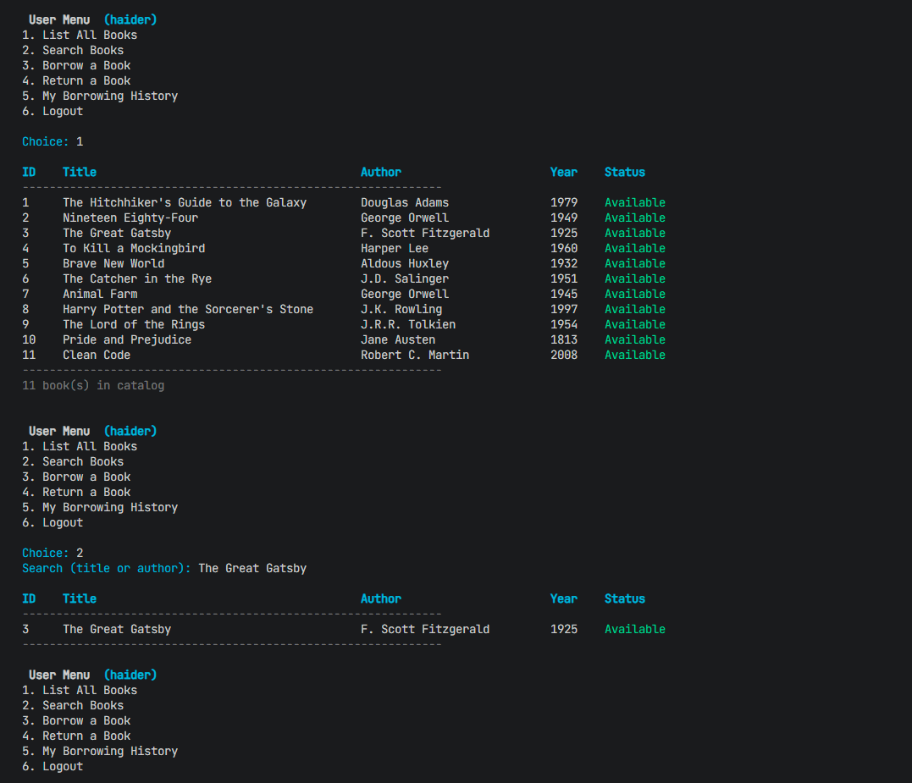

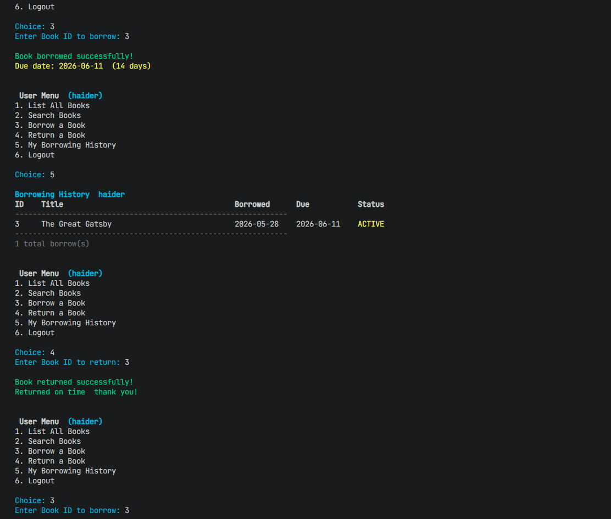

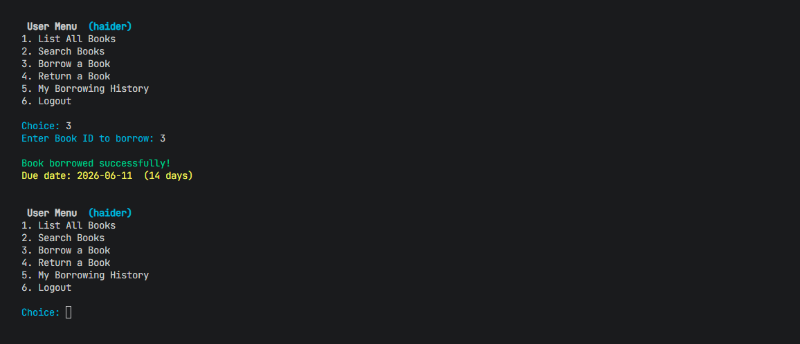

## Project Structure

```text
.
|-- main.c        # Authentication, catalog, borrowing, admin menus, and file storage
|-- Makefile      # Build, run, and clean commands
|-- assets/       # README screenshots
|-- history/      # Runtime borrowing history directory
|-- .gitignore    # Build output and runtime data exclusions
`-- README.md
```

Runtime files are generated automatically:

```text
library.txt
users.txt
history/<username>_history.txt
```

## Run On Windows With MinGW

Install MinGW-w64 and add its `bin` folder to PATH. Common examples:

```text
C:\mingw64\bin
C:\MinGW\bin
```

Verify the compiler:

```powershell
gcc --version
```

Compile and run:

```powershell
gcc -std=c99 -Wall -Wextra -pedantic main.c -o library-management-system.exe
.\library-management-system.exe
```

## Run On Windows With MSYS2 UCRT64

Install MSYS2 from:

```text
https://www.msys2.org/
```

Open the **MSYS2 UCRT64** terminal and update packages:

```bash
pacman -Syu
```

If MSYS2 asks you to close the terminal, close it, open **MSYS2 UCRT64** again, then install GCC and Make:

```bash
pacman -S mingw-w64-ucrt-x86_64-gcc make git
```

Add UCRT64 to your Windows PATH if you want `gcc` available from PowerShell:

```text
C:\msys64\ucrt64\bin
```

Clone and run:

```bash
git clone https://github.com/haiderrrrrrr/c-library-management-system.git
cd c-library-management-system
make
make run
```

## Run On Ubuntu Or WSL

Install build tools:

```bash
sudo apt update
sudo apt install build-essential git
```

Clone and run:

```bash
git clone https://github.com/haiderrrrrrr/c-library-management-system.git
cd c-library-management-system
make
make run
```

## Common Commands

Build:

```bash
make
```

Run:

```bash
make run
```

Clean build output:

```bash
make clean
```

Direct compile:

```bash
gcc -std=c99 -Wall -Wextra -pedantic main.c -o library-management-system
```

## Data Format

Book records use pipe-delimited fields:

```text
id|title|author|year|is_borrowed
```

User records store a username, password hash, and admin flag:

```text
username|djb2_hash|is_admin
```

Borrowing history records store the book, borrow date, due date, and status:

```text
book_id|title|borrow_unix|due_unix|status
```
